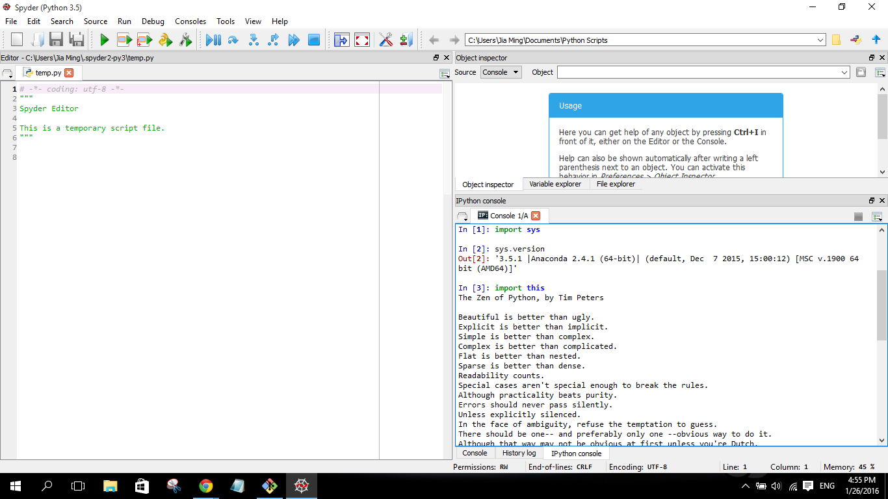

UECM3033 Assignment #1 Report
========================================================

- Prepared by: ** Khoo Jia Ming**
- Tutorial Group: T3

--------------------------------------------------------

## Task 1 -- setup a github repository

The reports, codes and supporting documents are uploaded to Github at: 

[https://github.com/your_github_id/UECM3033_assign1](https://github.com/your_github_id/UECM3033_assign1)

---------------------------------------------------------

## Task 2 -- setup python

Put here the screen shot of file (python.png)

------------------------------------------------------------

## Task 3 -- modify and run Python script

The Python script was changed. My student ID was key in to find the hexadecimal representation. The original integral was replaced, and a system of 10 linear equations with unique solution was setup. The report of assignment 1 was written in both markdown file and microsoft words file. Below are the answer given in console:

1. The hexadecimal value of your student ID.
0x1564e2

2. Write down the definite integrals that you have chosen.
$$\int_0^{\infty} {cos{x}}*{sin{x}}*{exp{x}} dx = \frac{{\exp{\x}}*{{\sin{2x}}-{\2con{2x}}}}{10}.$$

3. Write down your system of 10 linear equations.

\begin{align*}
3 x_0 + 2 x_1 + x_2 + 9 x_3 + 8 x_4 + 7 x_5 + 6 x_6 + 5 x_7 + 4 x_8 + 1 x_9 &= 8,
x_0 + 2 x_1 + 8 x_2 + 4 x_3 + 9 x_4 + 6 x_5 + 7 x_6 + 5 x_7 + x_8 + 6 x_9 &=5 ,
9 x_0 + 4 x_1 + 5 x_2 + 2 x_3 + 7 x_4 + 8 x_5 + 6 x_6 + 1 x_7 + 3 x_8 + 4 x_9 &=4 ,
-4 x_0 + 5 x_1 + 9 x_2 + 3 x_3 + 8 x_4 + 5 x_5 + 6 x_6 + 8 x_7 - x_8 + 5 x_9 &=7 ,
9 x_0 - 5 x_1 + 3 x_2 + 7 x_3 + 4 x_4 + 8 x_5 + 2 x_6 + 6 x_7 + 9 x_8 + x_9 &=9 ,
7 x_0 + 3 x_1 + 8 x_2 + x_3 + 9 x_4 + 4 x_5 - 5 x_6 + 8 x_7 + 2 x_8 + 7 x_9 &=6 ,
7 x_0 + 9 x_1 + 5 x_2 + x_3 + 8 x_4 + 6 x_5 + 3 x_6 + 4 x_7 + 8 x_8 + 2 x_9 &=3 ,
8 x_0 + 2 x_1 + x_2 + 4 x_3 + 7 x_4 + 6 x_5 + 9 x_6 + 2 x_7 + 5 x_8 + x_9 &=2 ,
4 x_0 + 8 x_1 + 3 x_2 + 7 x_3 + 2 x_4 + x_5 + 9 x_6 + 3 x_7 + 5 x_8 + 8 x_9 &=1 ,
6 x_0 + 4 x_1 + 8 x_2 + 2 x_3 + 5 x_4 + x_5 + 9 x_6 + 3 x_7 + 7 x_8 + 5 x_9 &=5 .
\end{align*}

-----------------------------------

last modified: 29 JAN 2016
